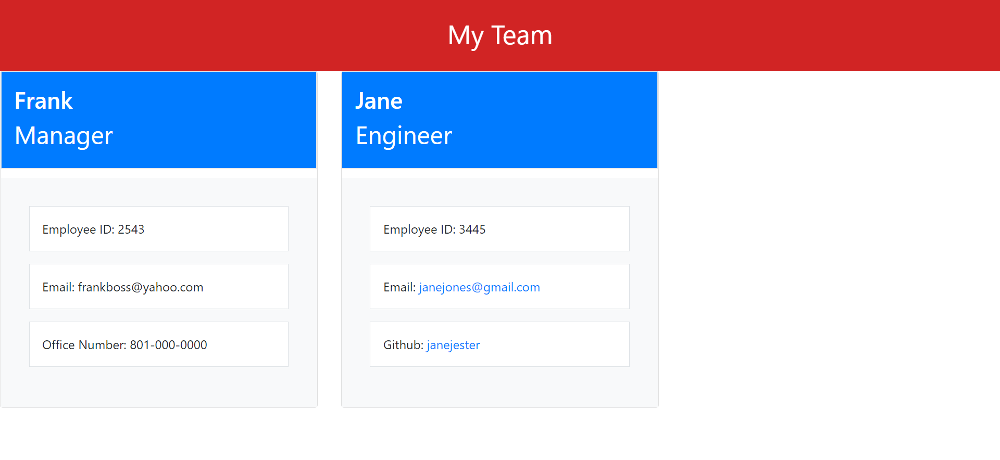

# Team Generator  

  ## Table of Contents
  --------------------
  - [Description](#description)
  - [Installations-Usage](#Installation-Usage)
  - [Contributing](#contribution)
  - [Tests](#testing)
  - [License](#licenses)
  - [Questions](#contact)

  ## Description
  --------------
  This application allows you to put together a web view of your work team!

  ## Installation-Usage
  ---------------
  Install the NPM packages necessary using npm i, and then run node index.js!

 
 [Video](https://vimeo.com/697819555)

  ## Contribution
  --------------------------
  Contribution is not allowed on this repo!

  ## Testing
  ---------------------
  You can use Jest to test difference senarios in the code!

  ## Licenses
  ----------------
  
   
  This application is licensed by:   None

  ## Contact!
  --------------
  Feel free to message me with any questions!

  GitHub: [HottieHotton](https://github.com/HottieHotton)

  Email: [Gmail](mailto:bhotton25@gmail.com)
